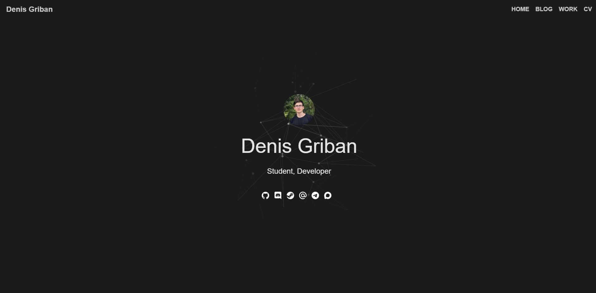

# My Website — Denis Griban's Personal Portfolio Site

[](README.md)


## About the Project

My personal portfolio website built with **Flask**.



## Features

- **Interactive Canvas background.** A grid of points connected by lines to their nearest neighbors: the points drift smoothly and the lines light up around the cursor. The animation is written in JavaScript (Canvas 2D API) with the GSAP library (TweenMax) and adapts to the window size.
- **Profile links** as SVG icons with pop-up tooltips: GitHub, Discord, Steam, email, Telegram and MAX.
- **Navigation:** HOME, BLOG, WORK and CV.
- **Dark theme** built with plain CSS: flexbox layout, a round avatar and a semi-transparent fixed header.

## Technologies Used

| Technology | Purpose |
| ---------- | ------- |
| [Python 3](https://www.python.org/) and [Flask](https://flask.palletsprojects.com/) | Backend: routing and serving pages |
| [Jinja2](https://jinja.palletsprojects.com/) | Templates (`render_template`, `url_for`), included with Flask |
| [Gunicorn](https://gunicorn.org/) | WSGI server for running in production |
| HTML5, CSS3 | Markup and styling: flexbox, tooltips without JavaScript |
| JavaScript (Canvas 2D API) | Background animation |
| Inline SVG | Social network icons |

## Repository Structure

```
My-Website/
├── app.py                # Flask application and routes
├── requirements.txt      # dependencies: flask, gunicorn
├── templates/
│   └── index.html        # home page
└── static/
    ├── style.css         # styles
    ├── background.js     # Canvas background animation
    └── img/
        └── main-avatar.jpg
```

## Installation and Usage

1. Install [Python 3](https://www.python.org/downloads/).
2. Clone the repository, create a virtual environment and install the dependencies:

   ```bash
   git clone https://github.com/DenkiGO/My-Website.git
   cd My-Website
   python -m venv venv
   source venv/bin/activate        # Windows: venv\Scripts\activate
   pip install -r requirements.txt
   ```

3. Start the development server and open <http://127.0.0.1:5000>:

   ```bash
   python app.py
   ```

For production, use Gunicorn:

```bash
gunicorn app:app
```